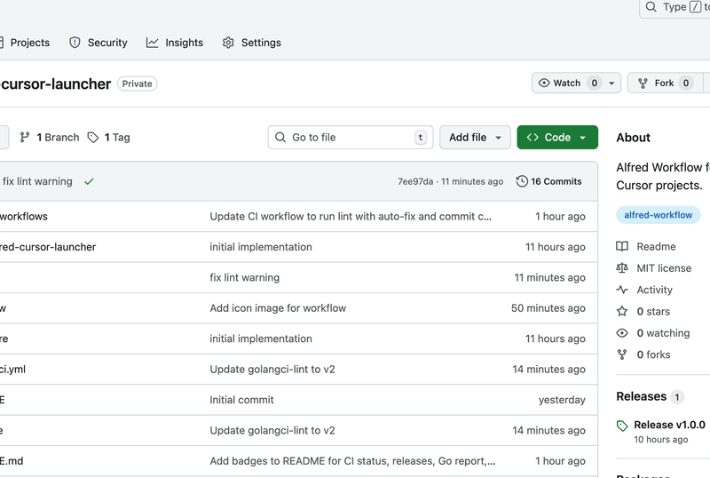

# Alfred Cursor Launcher

[](https://github.com/wozaki/alfred-cursor-launcher/actions/workflows/ci.yml)
[](https://github.com/wozaki/alfred-cursor-launcher/releases/latest)
[](https://goreportcard.com/report/github.com/wozaki/alfred-cursor-launcher)
[](https://go.dev/)
[](LICENSE)

Alfred Workflow for opening recent Cursor projects.

## Overview

This Alfred Workflow displays a list of recently opened Cursor projects and allows you to open the selected project in Cursor.

It supports both local projects and remote projects (SSH, Kubernetes, Dev Containers).



## Requirements

- macOS
- [Alfred](https://www.alfredapp.com/) (Powerpack required)
- [Cursor](https://cursor.sh/) editor installed

## Installation

### Method 1: Using Alfred Workflow File (Recommended)

1. Download the latest `alfred-cursor-launcher.alfredworkflow` from [Releases](https://github.com/wozaki/alfred-cursor-launcher/releases)
2. Double-click the downloaded file to install it in Alfred

### Method 2: Build from Source

```bash
# Clone the repository
git clone https://github.com/wozaki/alfred-cursor-launcher.git
cd alfred-cursor-launcher

# Install dependencies
go mod download

# Build and create Alfred Workflow file
make workflow
```

## Usage

### Setup

1. Open Alfred Preferences → Workflows → **Cursor Recent Projects**
2. Double-click the **Hotkey** object (left side of the workflow)
3. Set your preferred hotkey (e.g., `Option + Shift + C`)

### Opening Projects

1. Press your configured hotkey
2. A list of recently opened Cursor projects will be displayed
3. You can filter the list by typing keywords
4. Press Enter to open the selected project in Cursor

## Project Types

This workflow supports the following project types:

1. **Local Projects**: Regular local folders
2. **Remote Projects**:
   - Kubernetes containers
   - SSH remotes
   - Dev Containers / Remote Containers

Remote projects are displayed as "🌐 Project Name [Remote Info]".

**Note**: To open remote projects, Cursor must already have the remote connection configuration.

## Development

### Build

```bash
make build              # Regular build
make build-universal    # Universal Binary (Intel + Apple Silicon)
make workflow           # Create Alfred Workflow file
make clean              # Remove build artifacts
```

### Testing

```bash
make test
```

### Command Line Usage

```bash
# List projects
./bin/alfred-cursor-launcher list

# Open a project
./bin/alfred-cursor-launcher open "file:///path/to/project"
./bin/alfred-cursor-launcher open "vscode-remote://..."
```
